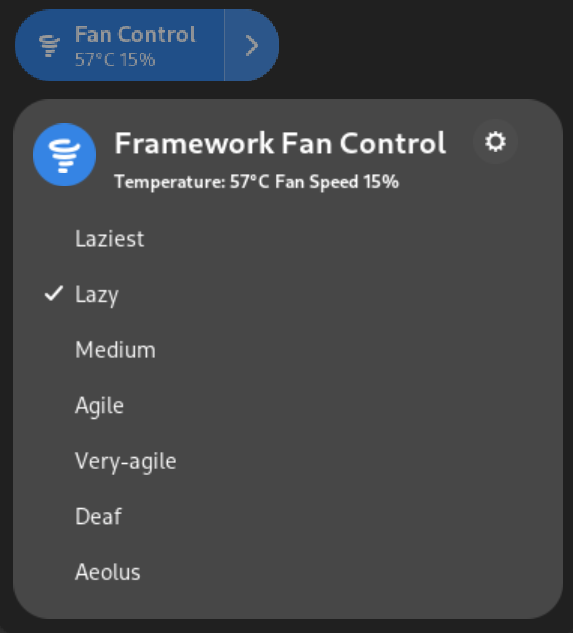

# Framework Fan Control Gnome Extension

A gnome extension that wraps
[fw-fanctrl](https://github.com/TamtamHero/fw-fanctrl) to provide an easy way to
set your fan profile. Inspired by
[joax/fw-fanctrl-gnome-shell-extension](https://github.com/joax/fw-fanctrl-gnome-shell-extension).

## Installation

1. Make sure you have the latest version of
[fw-fanctrl](https://github.com/TamtamHero/fw-fanctrl) installed.
2. Install the extension from the [Gnome extension store](https://github.com/ghostdevv/fw-fanctrl-revived-gnome-shell-extension).

## Differences from joax/fw-fanctrl-gnome-shell-extension

This extension is spiritual successor to
[joax/fw-fanctrl-gnome-shell-extension](https://github.com/joax/fw-fanctrl-gnome-shell-extension)
as the author was unfortunately unavailable. The differences we currently have
is supporting Gnome 47+, and the control is in quick settings rather than the
top bar for now.
